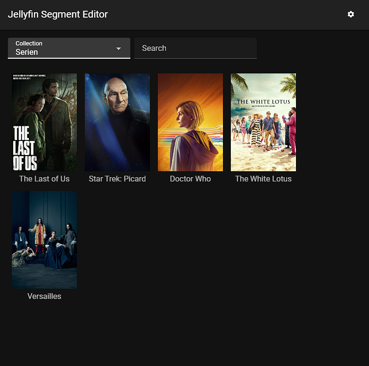
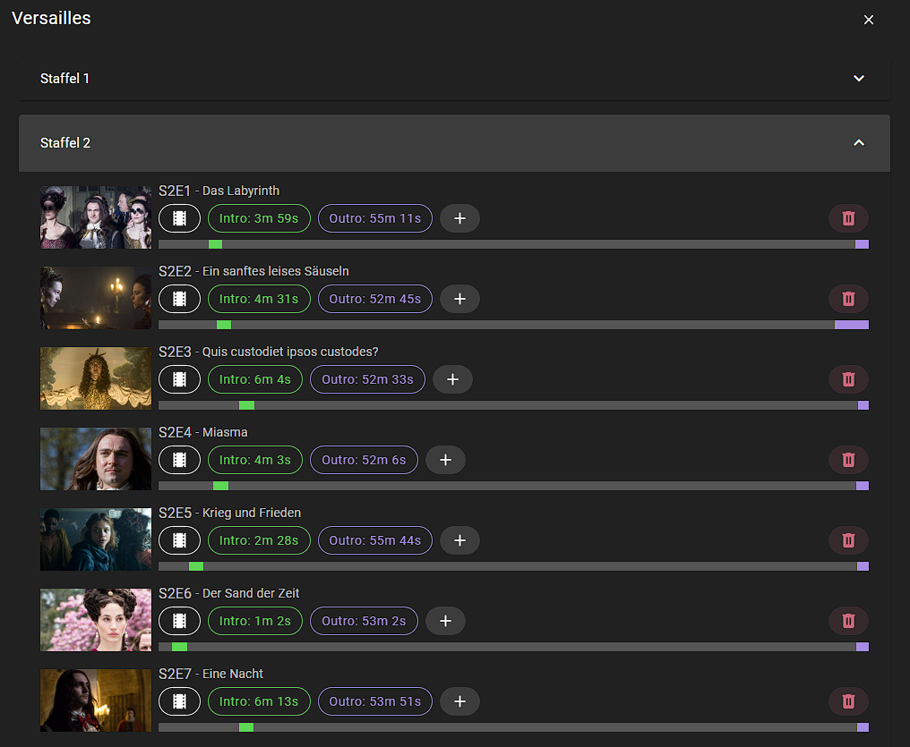
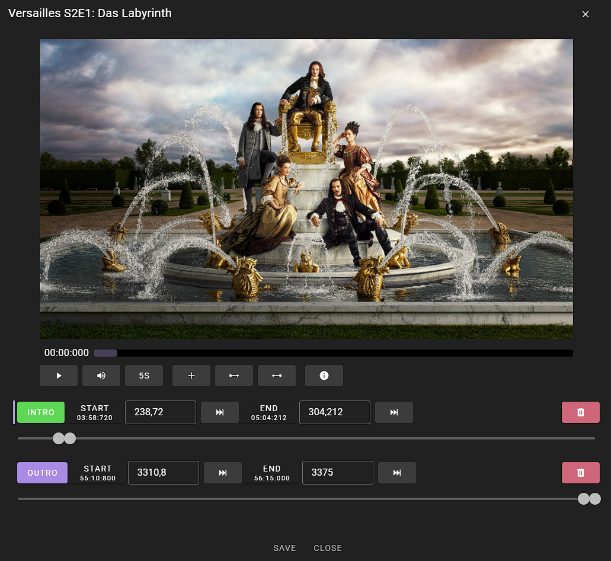

# Jellyfin Segment Editor

Manage Jellyfin Media Segment positions the simple way. This tool is in early stages of development.

* Create/Edit/Delete all kind of Segments (Intro, Outro, ...)
* Player to copy timestamps while you watch

## Requirements

* ⚠️ Jellyfin 10.10 unstable
* Jellyfin Plugin [MediaSegments API](https://github.com/endrl/jellyfin-plugin-ms-api)
* Jellyfin Server API Key (created by you)

## Installation

* Download for your platform from [Releases](https://github.com/endrl/segment-editor/releases/latest)

## Related projects

* Jellyfin Plugin: [Media Analyzer](https://github.com/endrl/jellyfin-plugin-media-analyzer)
* Jellyfin Plugin: [.EDL Creator](https://github.com/endrl/jellyfin-plugin-edl)
* Jellyfin Plugin: [MediaSegments API](https://github.com/endrl/jellyfin-plugin-ms-api)
* Player: [Jellyfin Vue Fork](https://github.com/endrl/jellyfin-vue)

## Work in progress

* List all versions of a movie
* [X] Player view
* Server side search query
* [X] Copy/Paste segments
* Add audio support
* More filter

## Pictures





## Development setup

Install node LTS, clone this repo and run

```bash
npm i && npm i -g @quasar/cli
```

### Start the app in development mode (hot-code reloading, error reporting, etc.)

```bash
quasar dev
```

### Lint the files

```bash
yarn lint
# or
npm run lint
```

### Format the files

```bash
yarn format
# or
npm run format
```

### Build the app for production

```bash
quasar build
```

## Tauri App building

Install [Rust](https://www.rust-lang.org/learn/get-started)

### Tauri dev

```bash
npm run tauri dev
```

### Tauri build for production

```bash
npm run tauri build
```

## Additional Tooling

* Changelog Management [git-cliff](https://github.com/orhun/git-cliff)
  * See the next version bump `git cliff --bumped-version`
  * Set the version in package.json
  * Create Changelog `git cliff --bump --output CHANGELOG.md`
  * Create and push the tag with version `git tag -a 1.4.0 -m "release 1.4"` and `git push origin tag 1.4.0`
